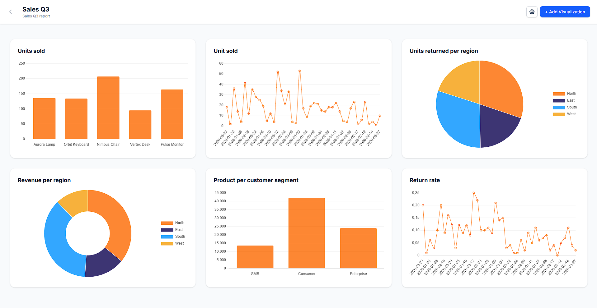

# Data Visualizer

Data Visualizer is a Laravel web app for creating dashboards from uploaded CSV datasets. Users can register, upload a dataset while creating a dashboard and add visualizations.



## Main Features

- User registration and login
- Dashboard creation from CSV uploads
- Automatic dataset storage and row parsing
- Bar, line, pie, and donut visualizations
- Dashboard theme settings and custom color themes
- Configurable number of visualizations per row
- Drag-and-drop visualization ordering
- Dashboard deletion with related visualization and dataset cleanup

## Requirements

- PHP 8.3 or newer
- Composer
- Node.js and npm
- SQLite, or another database supported by Laravel

## Setup

Install PHP and JavaScript dependencies:

```bash
composer install
npm install
```

Create the environment file and app key:

```powershell
Copy-Item .env.example .env
php artisan key:generate
```

For the default SQLite setup, make sure the database file exists:

```powershell
New-Item -ItemType File -Path database/database.sqlite -Force
```

Then run the migrations:

```bash
php artisan migrate
```

## Running Locally

Start the Vite server:

```bash
npm run dev
```

Open the local URL shown by Laravel, usually:

```text
http://127.0.0.1:8000
```

## Testing

Run the tests:

```bash
php artisan test
```
